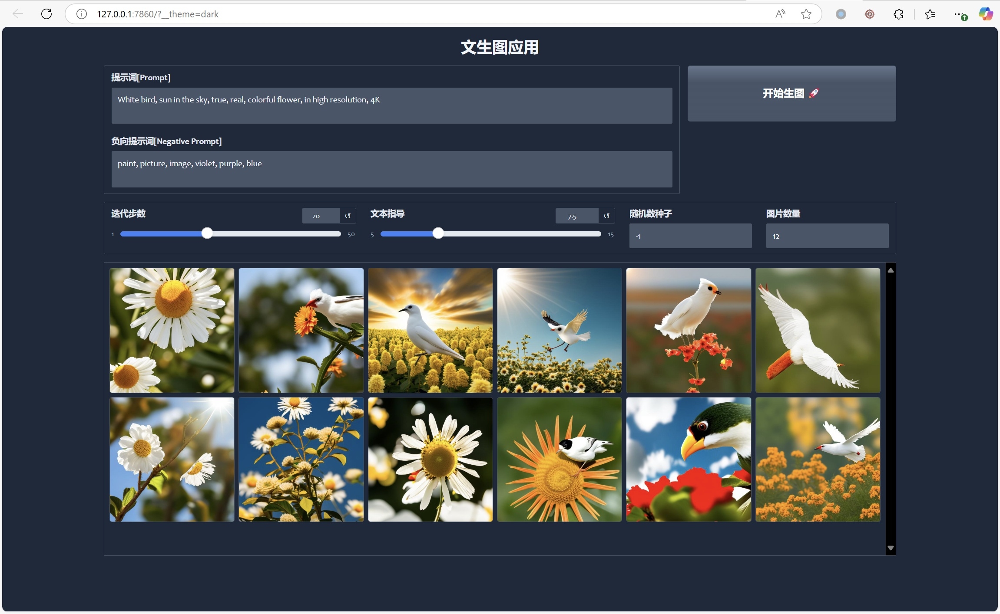

# README

## Introduction 
These samples helps developers use QAI AppBuilder + Python Gradio extension to build *WebUI* AI apps on Windows on Snapdragon (WoS) platforms.

## Setting Up Environment For WebUI Apps:

### Step 1: Install basic dependencies
Refer to [python.md](../../docs/python.md) on how to setup x64 version Python environment.

### Step 2: Install basic Python dependencies for WebUI
Run below commands in Windows terminal:
```
pip install gradio
```

### Step 3: Switch to webui directory:
Run below commands in Windows terminal:
```
cd ai-engine-direct-helper\samples
```

### Step 4: Run WebUI Apps:
Run the commands in below table to start WebUI apps.

### WebUI App List:

|  Model   | Command  |
|  ----  | :----    |
| ImageRepairApp | python webui\ImageRepairApp.py |
| StableDiffusionApp | python webui\StableDiffusionApp.py |
| GenieWebUI * | python webui\GenieWebUI.py |

*. Refer to step 3 here to [setup LLM models](../genie/python/README.md) before run 'GenieWebUI.py'.<br>
**. Refer to here to [setup Stable Diffusion v2.1 models](../python/README.md) before run 'GenieWebUI.py'.

### Screenshots:



